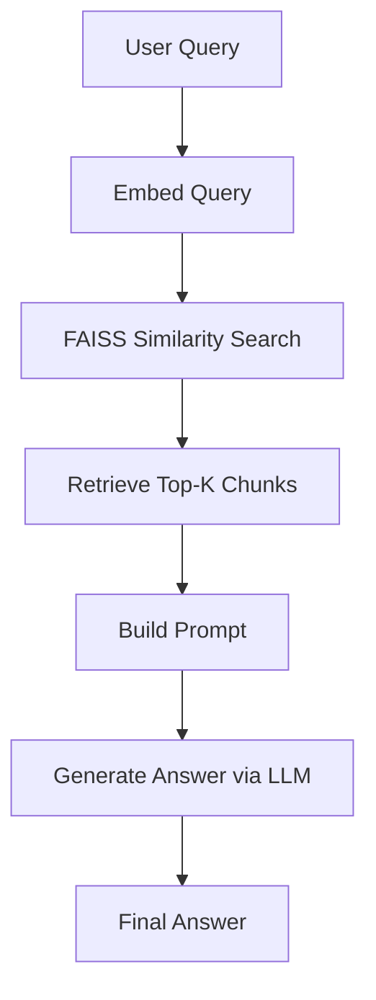

# 🧠 war-rag: Retrieval-Augmented Generation with *The Art of War*

This project demonstrates an end-to-end **RAG (Retrieval-Augmented Generation)** pipeline using LangChain, FAISS, and a local LLM (`orca-mini` via Ollama). The source content is Sun Tzu's *The Art of War* (public domain via Project Gutenberg).

---

## 📐 Project Goals

- Understand each stage of RAG: **Ingest → Embed → Retrieve → Augment → Generate**
- Use local models for embeddings and generation (no OpenAI needed)
- Build everything step by step inside a `.ipynb` notebook
- Prioritize **clarity over complexity** — one concept per cell

---

## 🧱 Stack

| Component | Technology |
|----------|------------|
| Text Source | [Project Gutenberg](https://www.gutenberg.org/ebooks/132) |
| Chunking | `RecursiveCharacterTextSplitter` |
| Embeddings | `nomic-embed-text` via Ollama |
| Vector DB | FAISS |
| LLM | `orca-mini` via Ollama |
| Frameworks | LangChain, LangGraph (optional) |
| Interface | Jupyter Notebook |
| Environment | Conda + `.env` configuration |

---

## 🔁 RAG Pipeline Overview

### 🧠 Conceptual Flow



### 🧪 Execution Phases


---

## 📓 Step-by-Step Summary

| Step | Purpose |
|------|---------|
| **1** | Download and clean *The Art of War* text |
| **2** | Chunk the document using `RecursiveCharacterTextSplitter` |
| **3** | Inspect chunk overlap |
| **4** | Embed each chunk via `nomic-embed-text` |
| **5** | Query FAISS with user input |
| **6** | Build a prompt from retrieved context |
| **7** | Pass prompt to `orca-mini` and generate grounded answer |

---

## 🧪 Example Query

> **Question**: "What does Sun Tzu say about deception?"  
> **Generated Answer**: According to Sun Tzu in *The Art of War*, deception plays a crucial role in warfare... *(retrieved from vector store and grounded)*

---

## 🔧 Local Setup

```bash
# Clone repo (if extracted elsewhere)
git clone <your-repo>
cd war-rag

# Create conda environment
conda create -n war-rag python=3.10
conda activate war-rag

# Install dependencies
pip install -r requirements.txt

# Pull models (if needed)
ollama pull nomic-embed-text
ollama pull orca-mini

# Run notebook
jupyter lab
```

`.env` file example:
```
EMBEDDING_MODEL=nomic-embed-text
```

---

## 🚀 Future Enhancements

- [ ] Add LangGraph orchestration of RAG flow
- [ ] Add streaming token output via FastAPI/CLI
- [ ] Build structured answer formatting or summarization layer
- [ ] Turn into a deployable chatbot or research assistant

---

## 📜 License

Content from *The Art of War* is in the public domain. This project is intended for learning and experimentation.